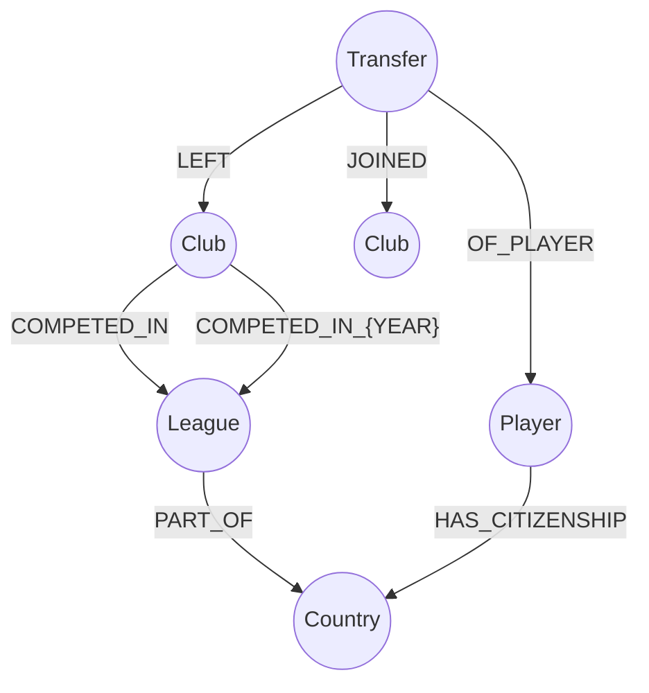
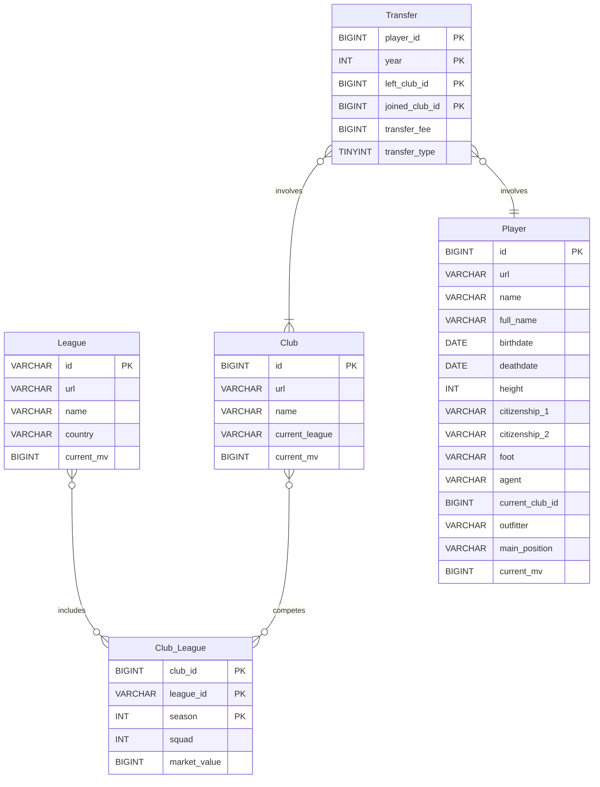

I'm excited to share our latest publication in **IEEE Data Descriptions**: the Soccer Player Transfer Dataset (SPTD) - a comprehensive database containing over 3 million soccer player transfer records spanning from 1870 to 2024!

## What is SPTD?

SPTD is the first dataset in the literature that historically organizes soccer player transfers in a structured, time-series format. We built this massive dataset by collecting and organizing unstructured data from [Transfermarkt](https://www.transfermarkt.com){:target="_blank" rel="noopener"} using sophisticated web scraping techniques.

### Dataset Highlights

- **3+ million transfer records**
- **12,000+ soccer clubs**
- **108 countries** represented
- **Historical data** from 1870 to 2024
- **Multiple formats**: SQL, CSV, JSON, and Neo4j graph database

## The Technical Challenge

Soccer player transfers represent a major financial aspect of the sport, with clubs spending billions annually on acquiring talent. However, this valuable data was scattered across millions of unstructured web pages. Our challenge was to:

1. Navigate millions of webpages on Transfermarkt
2. Extract and structure the data systematically
3. Handle duplicates and missing information
4. Organize data for various use cases (time-series, network analysis, etc.)

## Our Approach: Web Scraping at Scale

We developed custom web scraping algorithms using Python and [Scrapy](https://scrapy.org){:target="_blank" rel="noopener"} to collect and process this massive dataset. Our data pipeline consists of:

### Five Core Data Items

1. **League Item**: National leagues with their market values
2. **Club Item**: Soccer clubs and their current standings
3. **ClubLeague Item**: Historical record of clubs' league participations
4. **Player Item**: Detailed player information (15 attributes including citizenship, position, market value)
5. **Transfer Item**: Transaction details including fees, dates, and transfer types

### Web Scraping Architecture

Our Scrapy framework navigates four continental starting points (Europe, Asia, America, Africa) and systematically collects data through custom "spiders" - specialized algorithms that:

- Navigate complex website structures
- Extract and validate data
- Remove duplicates
- Transform unstructured HTML into structured datasets

## Multiple Format Support

To maximize accessibility and use cases, we provide the data in four formats:

1. **SQL Database**: For complex queries and relational analysis
2. **CSV Files**: For easy import into analysis tools
3. **JSON Files**: For API integration and web applications  
4. **Neo4j Graph Database**: For network analysis and relationship visualization

---

## Neo4j Graph Data Model

This graph data model enables the tracking of player movements between clubs, the leagues and countries they are associated with, and the citizenship of the players.

> The specialized relationship `COMPETED_IN_{YEAR}` is meant to reduce the number of nodes that need to be retrieved and therefore improving query performance.
{: .prompt-tip }

---

## SQL Relational Data Model

---

## Key Insights from the Data

Our initial analysis revealed fascinating patterns:

### Transfer Market Growth
- 1992: <25,000 transfers recorded
- 2023: >200,000 transfers recorded
- Average transfer fees peaked pre-pandemic, declined in 2020-21, then recovered

### Premier League Dominance
Chelsea FC leads both in money earned and spent on transfers, with four other English clubs (Manchester City, Manchester United, Liverpool FC, Tottenham Hotspur) in the top spenders list.

### Historical Coverage
Using Neymar's career as an example, we can trace every transfer from the beginning of his career through June 2024, visualized as an interactive graph in Neo4j.

## Potential Applications

This dataset enables numerous research and practical applications:

### Network Analysis
- Identify most influential leagues and clubs in the global transfer market
- Map transfer networks between regions and countries
- Study the flow of talent across continents

### Market Analysis
- Predict transfer values using ML algorithms
- Analyze market trends and seasonal patterns
- Segment leagues by their trading strategies

### Social & Political Studies
- Study migration patterns of soccer players
- Analyze globalization impacts on the sport
- Investigate economic inequalities in soccer

### MLOps Use Cases
- Build prediction models for player valuations
- Deploy real-time transfer monitoring systems
- Create recommendation systems for clubs

## Open Source and Reproducible

All code is available in our [GitHub repository](https://github.com/otaviofbrito/Transfermarkt-Scraper){:target="_blank" rel="noopener"} with:
- Complete Scrapy algorithms
- Docker container for reproducibility
- Documentation for building your own version
- Tools to extend the dataset with current transfers

## Research Team

This work was a collaborative effort:
- **Alicia G. D. Franco** 
- **Otavio F. B. Silveira** 
- **Flávio B. Gonzaga** 
- **Iago A. Carvalho**

## Publication Details

- **Journal**: IEEE Data Descriptions (Volume 2)
- **Pages**: 125-132
- **Publication Date**: May 13, 2025
- **DOI**: [10.1109/IEEEDATA.2025.3569490](https://doi.org/10.1109/IEEEDATA.2025.3569490)
- **License**: Open Access under Creative Commons BY 4.0

## Impact on Data Science & ML

This dataset represents a significant contribution to the sports analytics community:

- **First comprehensive historical transfer database**
- **Multiple storage formats for different use cases**
- **Network analysis capabilities with Neo4j**
- **Time-series data for trend analysis**
- **Reproducible collection methodology**

## Access the Dataset

The complete dataset and source code are available for researchers and practitioners worldwide:

[Read the Full Paper on IEEE Xplore →](https://ieeexplore.ieee.org/document/11002621){:target="_blank" rel="noopener"}

[Download Dataset on Kaggle →](https://www.kaggle.com/datasets/otaviofbrito/soccer-player-transfer-dataset){:target="_blank" rel="noopener"}

[View Source Code on GitHub →](https://github.com/otaviofbrito/Transfermarkt-Scraper){:target="_blank" rel="noopener"}

---

> We hope this comprehensive and structured data serves as an important resource for researchers worldwide and helps soccer club administrators improve their decision-making related to player transfers.
{: .prompt-info }

## Get Involved

Interested in using this dataset for your research or building applications? The dataset is freely available under Creative Commons licensing. Check out the [Publications page](/publications/) for more details or [connect with me on LinkedIn](https://www.linkedin.com/in/otaviobrito) to discuss collaboration opportunities!
